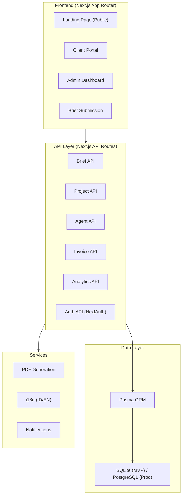
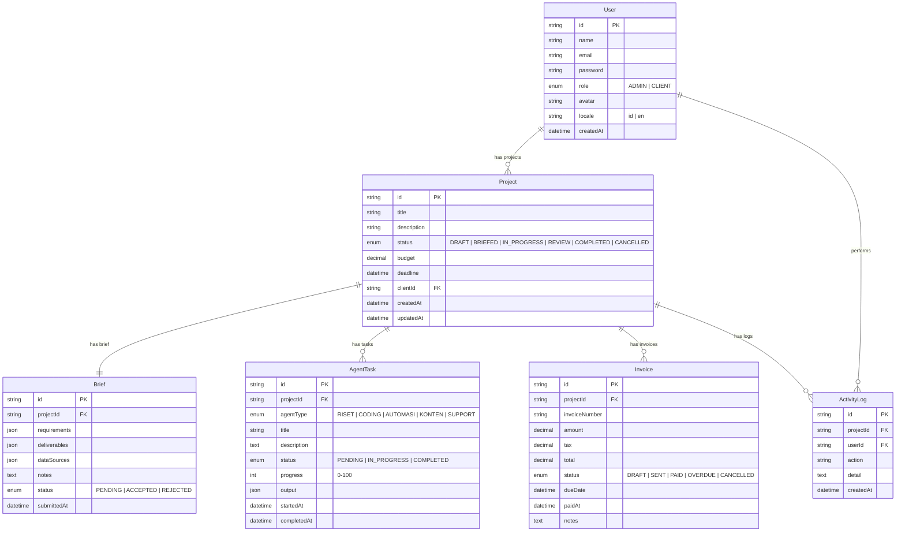

# AI Agent Service Platform — "AgentFlow"

A full-stack Next.js web platform for managing an AI-powered service agency. Inspired by the "Jual Jasa Pakai AI Agents" business model — accept client briefs, delegate work to AI agent teams, track progress, invoice, and get paid.

## User Review Required

> [!IMPORTANT]
> **Database Choice**: The plan uses **SQLite via Prisma** for the MVP to avoid external DB setup. For production, you'd migrate to PostgreSQL. Is this acceptable for the initial build?

> [!IMPORTANT]
> **Authentication**: The plan uses **NextAuth.js** with credentials-based login (email/password) for MVP. No OAuth providers initially. Confirm if this is sufficient.

> [!IMPORTANT]
> **Payment Integration**: Invoice generation is included, but actual payment gateway integration (Midtrans, Xendit, etc.) is **not** in scope for MVP. Invoices will be generated as downloadable PDFs with manual payment status tracking. Should we include a payment gateway?

## Open Questions

> [!NOTE]
> 1. **Domain/Project Name**: I'm using "AgentFlow" as the working name. Do you have a preferred name?
> 2. **Deployment Target**: Vercel? Self-hosted? This affects some architecture decisions.
> 3. **Multi-tenant**: Should multiple founders/agencies be able to use the platform, or is this a single-agency tool?

---

## Architecture Overview



## Database Schema



---

## Proposed Changes

### 1. Project Scaffolding

#### [NEW] Project Root Setup
- Initialize Next.js 15 app with App Router, TypeScript, and ESLint
- Install dependencies: Prisma, NextAuth, next-intl (i18n), react-icons, recharts (charts), @react-pdf/renderer, framer-motion, date-fns
- Configure Prisma with SQLite
- Set up folder structure:

```
agentflow/
├── prisma/
│   ├── schema.prisma
│   └── seed.ts                    # Seed data for demo
├── public/
│   └── images/                    # Static assets
├── src/
│   ├── app/
│   │   ├── (auth)/
│   │   │   ├── login/page.tsx
│   │   │   └── register/page.tsx
│   │   ├── (dashboard)/
│   │   │   ├── layout.tsx         # Sidebar + topbar layout
│   │   │   ├── page.tsx           # Analytics dashboard (home)
│   │   │   ├── projects/
│   │   │   │   ├── page.tsx       # Project list
│   │   │   │   ├── [id]/page.tsx  # Project detail + agent tasks
│   │   │   │   └── new/page.tsx   # New brief submission
│   │   │   ├── agents/page.tsx    # AI agent team overview
│   │   │   ├── invoices/
│   │   │   │   ├── page.tsx       # Invoice list
│   │   │   │   └── [id]/page.tsx  # Invoice detail + PDF
│   │   │   ├── clients/page.tsx   # Client management
│   │   │   └── settings/page.tsx  # Settings + language toggle
│   │   ├── portal/                # Client-facing portal
│   │   │   ├── layout.tsx
│   │   │   ├── page.tsx           # Client dashboard
│   │   │   ├── projects/[id]/page.tsx
│   │   │   └── submit-brief/page.tsx
│   │   ├── api/
│   │   │   ├── auth/[...nextauth]/route.ts
│   │   │   ├── projects/route.ts
│   │   │   ├── projects/[id]/route.ts
│   │   │   ├── briefs/route.ts
│   │   │   ├── agents/route.ts
│   │   │   ├── invoices/route.ts
│   │   │   └── analytics/route.ts
│   │   ├── layout.tsx             # Root layout
│   │   ├── page.tsx               # Landing page (public)
│   │   └── globals.css
│   ├── components/
│   │   ├── ui/                    # Reusable UI primitives
│   │   │   ├── Button.tsx
│   │   │   ├── Card.tsx
│   │   │   ├── Badge.tsx
│   │   │   ├── Modal.tsx
│   │   │   ├── Input.tsx
│   │   │   ├── Select.tsx
│   │   │   ├── Table.tsx
│   │   │   ├── ProgressBar.tsx
│   │   │   ├── Avatar.tsx
│   │   │   └── Skeleton.tsx
│   │   ├── layout/
│   │   │   ├── Sidebar.tsx
│   │   │   ├── Topbar.tsx
│   │   │   └── MobileNav.tsx
│   │   ├── dashboard/
│   │   │   ├── StatsCards.tsx
│   │   │   ├── RevenueChart.tsx
│   │   │   ├── ProjectPipeline.tsx
│   │   │   └── RecentActivity.tsx
│   │   ├── projects/
│   │   │   ├── ProjectCard.tsx
│   │   │   ├── BriefForm.tsx
│   │   │   ├── ProjectTimeline.tsx
│   │   │   └── AgentTaskPanel.tsx
│   │   ├── agents/
│   │   │   ├── AgentCard.tsx
│   │   │   └── AgentWorkload.tsx
│   │   ├── invoices/
│   │   │   ├── InvoiceTable.tsx
│   │   │   └── InvoicePDF.tsx
│   │   └── i18n/
│   │       └── LanguageToggle.tsx
│   ├── lib/
│   │   ├── prisma.ts              # Prisma client singleton
│   │   ├── auth.ts                # NextAuth config
│   │   ├── i18n.ts                # Internationalization setup
│   │   └── utils.ts               # Helpers (formatCurrency, etc.)
│   ├── hooks/
│   │   ├── useProjects.ts
│   │   ├── useAgents.ts
│   │   └── useAnalytics.ts
│   ├── types/
│   │   └── index.ts               # TypeScript types
│   └── locales/
│       ├── id.json                # Indonesian translations
│       └── en.json                # English translations
├── .env
├── next.config.js
├── tailwind.config.ts
├── tsconfig.json
└── package.json
```

---

### 2. Design System & Styling

#### [NEW] globals.css
Premium design system inspired by the infographic's warm color palette:

| Token | Value | Usage |
|---|---|---|
| `--primary` | `#E8652D` (Warm Orange) | CTAs, accents, active states |
| `--primary-light` | `#FFF3ED` | Backgrounds, hover states |
| `--secondary` | `#2D8B4E` (Forest Green) | Success, checkmarks, badges |
| `--surface` | `#FBF8F4` | Page backgrounds (warm cream) |
| `--surface-card` | `#FFFFFF` | Card backgrounds |
| `--text-primary` | `#1A1A1A` | Headings |
| `--text-secondary` | `#6B7280` | Body text |
| `--border` | `#E5E1DB` | Subtle borders |
| `--danger` | `#DC2626` | Error, overdue |
| `--warning` | `#F59E0B` | Pending, attention |

Typography: **Inter** (body) + **Plus Jakarta Sans** (headings) from Google Fonts

Key design features:
- Glassmorphism cards with subtle backdrop blur
- Smooth micro-animations (Framer Motion)
- Warm cream backgrounds matching the infographic aesthetic
- Gradient accents on key elements
- Dark mode support (secondary priority)

---

### 3. Core Features

#### Feature 1: Landing Page (Public)
- Hero section with value proposition
- 2-step process visualization (matching the infographic flow)
- AI agent team showcase
- Pricing/CTA section
- Client testimonials (placeholder)
- Bilingual toggle in navbar

#### Feature 2: Authentication
- Login/Register pages with premium design
- Role-based access: `ADMIN` (founder) and `CLIENT`
- Session management via NextAuth
- Protected routes with middleware

#### Feature 3: Client Brief Submission
- Multi-step form: Company info → Requirements → Data sources → Deliverables → Timeline & Budget
- Rich text editor for descriptions
- File attachment placeholders
- Auto-save draft functionality
- Brief status tracking (Pending → Accepted → Rejected)

#### Feature 4: Project Management
- Kanban-style project pipeline (Draft → Briefed → In Progress → Review → Completed)
- Project detail page with:
  - Brief summary
  - AI Agent task breakdown with progress bars
  - Timeline visualization
  - Activity log
  - Invoice section

#### Feature 5: AI Agent Team Dashboard
- 5 agent cards (Riset, Coding, Automasi, Konten, Support) with robot avatars
- Per-agent task queue and workload visualization
- Task assignment to agents
- Progress tracking per agent (0-100%)
- Status indicators (idle, working, completed)
- Simulated AI agent activity (demo mode)

#### Feature 6: Project Timeline & Progress
- Gantt-like timeline per project
- Milestone tracking
- Agent task dependencies
- Real-time progress aggregation
- Deadline alerts

#### Feature 7: Invoice Generation & Tracking
- Auto-generate invoice from project details
- Invoice number auto-increment
- Line items, tax calculation
- Status tracking (Draft → Sent → Paid → Overdue)
- PDF generation & download
- Payment history

#### Feature 8: Client Portal
- Separate view for clients to:
  - Submit new briefs
  - View project progress
  - See agent work status
  - Download invoices
  - Chat/comment (placeholder)

#### Feature 9: Analytics Dashboard
- Revenue metrics (total, monthly, projected)
- Project completion rate
- Agent utilization rates
- Client satisfaction indicators
- Interactive charts (Recharts)
- Date range filters

#### Feature 10: Bilingual Support (ID/EN)
- next-intl integration
- Language toggle in settings and navbar
- All UI text in locale files
- Currency formatting (Rp / $)
- Date formatting per locale

---

### 4. Component Implementation Order

| Phase | Components | Priority |
|---|---|---|
| **Phase 1** | Project scaffold, design system, UI primitives, landing page | 🔴 Critical |
| **Phase 2** | Auth, database schema, API routes, brief submission | 🔴 Critical |
| **Phase 3** | Dashboard layout, project list/detail, agent dashboard | 🟡 High |
| **Phase 4** | Invoice generation, PDF export, analytics | 🟡 High |
| **Phase 5** | Client portal, timeline visualization | 🟢 Medium |
| **Phase 6** | Bilingual support, polish, animations | 🟢 Medium |

---

## Verification Plan

### Automated Tests
```bash
# Build check
npm run build

# Lint check
npm run lint

# Prisma schema validation
npx prisma validate

# Seed database
npx prisma db seed
```

### Manual Verification
- Navigate all routes and verify rendering
- Submit a sample brief and track through pipeline
- Generate and download an invoice PDF
- Test language toggle (ID ↔ EN)
- Verify responsive design on mobile viewports
- Check all micro-animations and transitions
- Test role-based access (admin vs client views)

---

## Estimated Scope

> [!WARNING]
> This is a **large project** with ~40+ files. Implementation will be done in phases. Phase 1-3 (core functionality) will be built first, then Phase 4-6 (extended features). The full implementation will take significant effort.

> [!TIP]
> For the initial MVP, the platform will use **mock/seed data** to demonstrate all features. Real AI agent integration and payment processing would be Phase 7+ enhancements.
